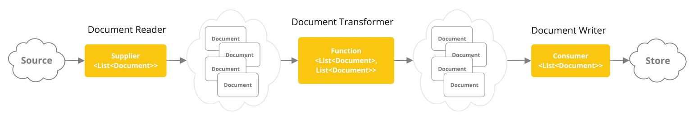
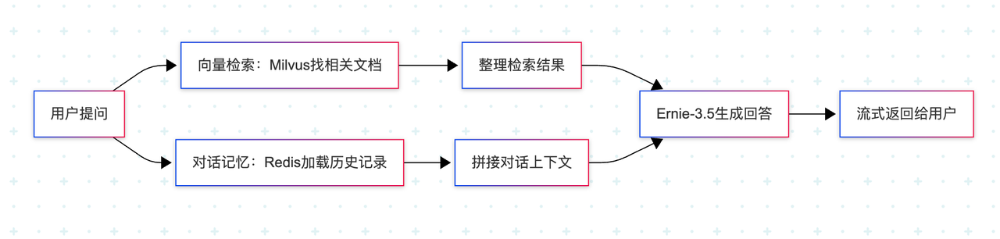
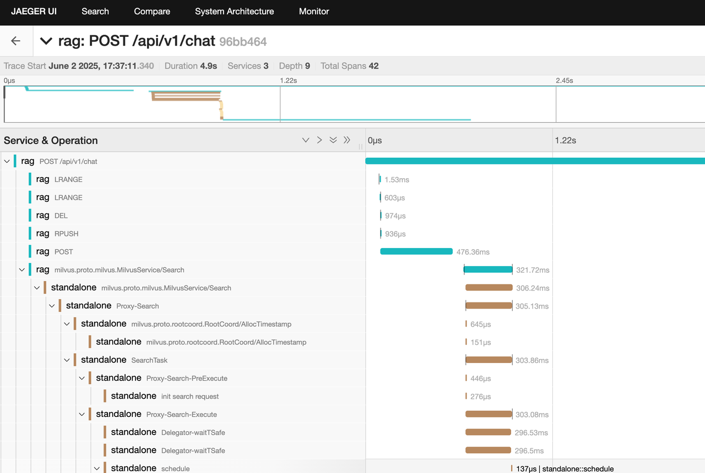

# 用 Spring 打造企业级 AI 助手：一套可落地的文档问答系统全流程实践指南

### 导语：AI 如何激活沉睡的企业知识？

在企业数字化转型的浪潮中，PDF、Word 等海量文档往往沉睡在各个业务系统中，形成“数据孤岛”，难以被智能系统高效利用。客服人员反复处理重复问题，研发工程师在冗长手册中苦苦搜索解决方案，知识无法流动，效率难以提升。

那么，如何构建一个真正**面向企业场景落地**的 AI 应用，让 AI 成为企业的“智能助手”？本项目提供一套基于 Spring 框架的完整解决方案，结合文档 ETL、向量检索与 RAG 问答技术，覆盖从数据导入到智能对话的全链路实践。

与其他演示不同，本项目强调**企业级能力建设**——包括 API 安全控制、指标可观测性等工程化特性。借助 Spring 强大的生态系统与 Java 社区对“高可维护、高可扩展系统”的成熟支持，我们将打造一个**真正适合在企业环境中上线运行**的 AI 应用。

---

## 一、项目准备：环境与依赖的“黄金组合”

### 技术栈速览

- **框架**：Spring Boot 3.5.0 + Spring AI 1.0.0
- **语言**：Java 17（长期支持）
- **AI 模型**：百度千帆（OpenAI 接口兼容）
- **向量存储**：Milvus（高性能语义检索）
- **工具链**：Docker、Micrometer、Testcontainers

### 环境配置避坑指南

示例代码仓库 [https://github.com/topikachu/spring-ai-rag](https://github.com/topikachu/spring-ai-rag)

```shell
# 验证 Docker 是否正常运行
$ docker version
$ docker ps
```

---

## 二、模型选择：百度千帆如何平替 OpenAI？

### 为什么选百度千帆？

- 免费额度友好：ernie-3.5-128k 和 tao-8k 均可免费试用
- 接口兼容：与 Spring AI 的 OpenAI 接口高度兼容，几乎零开发成本切换
- 在线模型列表： [https://console.bce.baidu.com/qianfan/ais/console/onlineService](https://console.bce.baidu.com/qianfan/ais/console/onlineService)
- 申请模型 API Key： [https://console.bce.baidu.com/iam/#/iam/apikey/list](https://console.bce.baidu.com/iam/#/iam/apikey/list)

### 关键配置（application.properties）

```
spring.ai.openai.base-url=https://qianfan.baidubce.com
spring.ai.openai.chat.completions-path=/v2/chat/completions
spring.ai.openai.chat.options.model=ernie-3.5-128k
spring.ai.openai.embedding.embeddings-path=/v2/embeddings
spring.ai.openai.embedding.options.model=tao-8k
spring.ai.openai.api-key=${OPENAI_API_KEY}
spring.ai.model.embedding=openai
```

✅ **实操建议**：用在线模型 API 工具验证密钥有效性，再接入项目。
📌 Tip：tao-8k 嵌入模型仅支持单条输入，需调整分块逻辑，确保每次请求一个文档段落，下文有代码示例。
⚠️ 不要在代码或者配置文件里硬编码 API KEY，更不要提交到代码仓库。在生产中考虑使用环境变量。

---

## 三、核心功能开发：让文档“说话”的数据之旅

### 1. 文档 ETL：非结构化数据结构化处理

#### 处理流程：

- **DocReader**：使用 `TikaDocReader` 读取 PDF/Word 等
- **TextSplitter**：基于 token 分块，控制上下文长度
- **向量生成**：调用 `tao-8k` 接口
- **存入向量库**：Milvus 自动管理



#### 示例代码：

```java
public Flux<Document> ingestionFlux() {
  return documentReader.getDocuments()
          .flatMap(document -> {
            var processChunks = Mono.fromRunnable(() -> {
              var chunks = textSplitter.apply(List.of(document));
              vectorStore.write(chunks); // expensive operation
            }).subscribeOn(Schedulers.boundedElastic());

            return Flux.concat(
                    Flux.just(document),
                    processChunks.then(Mono.empty())
            );
          })
          .doOnComplete(() -> log.info("RunIngestion() finished"))
          .doOnError(e -> log.error("Error during ingestion", e));
}
```

✅ **注意**：百度千帆嵌入 API 仅支持单文档请求，需确保 ETL 实现为“单文档单请求”。

```java
@Bean
BatchingStrategy singleDocumentBatchingStrategy() {
  return documents -> documents.stream().map(List::of).toList();
}
```

### 2. 向量存储：用 Milvus 实现“秒级语义检索”

#### 配置示例：

```
spring.ai.vectorstore.milvus.initialize-schema=true
spring.ai.vectorstore.milvus.embedding-dimension=1024
```

📌 说明：例如用户问“刘备结义排第几”，Milvus 会返回相关文档段落，再由语言模型生成自然语言答案。

### 3. RAG 对话：结合知识库与上下文的智能问答

#### 核心逻辑：

- 用户提问
- 向量检索相关段落
- 加载对话记忆（Redis）
- 生成 AI 回答



#### 对话向量检索与记忆集成示例：

```java
public ChatClient.ChatClientRequestSpec input(String userInput, String conversationId) {
  return ChatClient.builder(chatModel)
          .build().prompt()
          .advisors(
                  new QuestionAnswerAdvisor(vectorStore),
                  MessageChatMemoryAdvisor.builder(chatMemory).build()
          )
          .advisors(spec -> spec.param(CONVERSATION_ID, conversationId))
          .user(userInput);
}
```

📌 提升前端体验：使用 stream 接口返回 `Flux`，通过 SSE 实现打字机效果：

```java
public Flux<String> stream(String userInput, String conversationId) {
    return input(userInput, conversationId)
            .stream().content();
}
```

```java
@PostMapping(path = "/chat", produces = MediaType.TEXT_EVENT_STREAM_VALUE)
public Flux<String> chat(@RequestBody ChatRequest chatRequest, @RequestParam() String conversationId, Principal principal) {
  var conversationKey = String.format("%s:%s", principal.getName(), conversationId);
  return chatService.stream(chatRequest.userInput, conversationKey)
          .doOnError(exp -> log.error("Error in chat", exp));
}
```

---

## 四、API 安全与系统可观察性

### 1. API 安全加固

#### 权限控制示例：

```java
@Override
protected void configure(HttpSecurity http) throws Exception {
    http
        .httpBasic()
        .and()
        .authorizeRequests(authz -> authz
            .antMatchers("/api/v1/index").hasRole("ADMIN")
            .anyRequest().authenticated()
        );
}
```

✅ 企业级加固：在正式的生产环境中建议升级为 OAuth2 / JWT 认证方案。

### 2. 系统可观察性

📌 链路追踪：本项目使用 OpenTelemetry JavaAgent，覆盖 Chat → Milvus → 模型调用的全链路调用追踪（grpc 调用链关键）

```
-javaagent:<path/to/opentelemetry-javaagent.jar> \
-Dotel.metrics.exporter=none \
-Dotel.logs.exporter=none
```

📌 指标监控：使用 Micrometer 自动暴露 Prometheus 指标，比如：

- 模型响应时间

```
# HELP gen_ai_client_operation_seconds  
# TYPE gen_ai_client_operation_seconds summary
gen_ai_client_operation_seconds_count{...} 1
```

- 向量检索耗时

```
# HELP db_vector_client_operation_seconds
# TYPE db_vector_client_operation_seconds summary
db_vector_client_operation_seconds_count{...} 1
```

#### 配置：

```
management.endpoints.web.exposure.include=prometheus
```

📌 Tip：Spring Boot 3.2 引入 OTEL starter，但由于不能覆盖 gRPC（Milvus client）调用链，本项目采用 JavaAgent 接入方式，以确保完整链路追踪。

---

## 五、示例工程使用

请修改 `百度千帆APIKEY`

```shell
export OPENAI_API_KEY=<百度千帆APIKEY>
mvn clean test package
docker compose up -d
java -javaagent:target/otel/opentelemetry-javaagent.jar -Dotel.metrics.exporter=none -Dotel.logs.exporter=none  -Dinput.directory=$PWD/src/test/resources/corpus  -jar target/rag-0.0.1-SNAPSHOT.jar

curl --location 'localhost:8080/api/v1/index' \
--user "admin:password" \
--header 'Content-Type: application/json' \
--data '{}'


curl --location 'localhost:8080/api/v1/chat?conversationId=liubei' \
--header 'Content-Type: application/json' \
--user "user:password" \
--data '{
    "userInput": "刘备结义时排第几？"
}'

curl --location 'localhost:8080/api/v1/chat?conversationId=liubei' \
--header 'Content-Type: application/json' \
--user "user:password" \
--data '{
    "userInput": "他哪里人？"
}'


curl --location 'localhost:8080/api/v1/chat?conversationId=guanyu' \
--header 'Content-Type: application/json' \
--user "user:password" \
--data '{
    "userInput": "关羽结义时排第几？"
}'

curl --location 'localhost:8080/api/v1/chat?conversationId=guanyu' \
--header 'Content-Type: application/json' \
--user "user:password" \
--data '{
    "userInput": "他哪里人？"
}'

curl "http://localhost:8080/actuator/prometheus"
```

打开 trace 界面 http://localhost:16686/，可以查看调用的 tracing 情况，如下图



## ✍️ 结语

从文档解析到智能对话，这个项目不仅仅是技术的堆叠，更是一次工程实践与 AI 认知的结合。通过 Spring AI + 向量数据库 + 企业级安全与可观测性，真正打通了“知识沉淀 → 智能服务”的链路。

## 如果你也在探索 AI 与企业系统的融合，欢迎留言交流，一起构建更智能、更可靠的未来系统。
